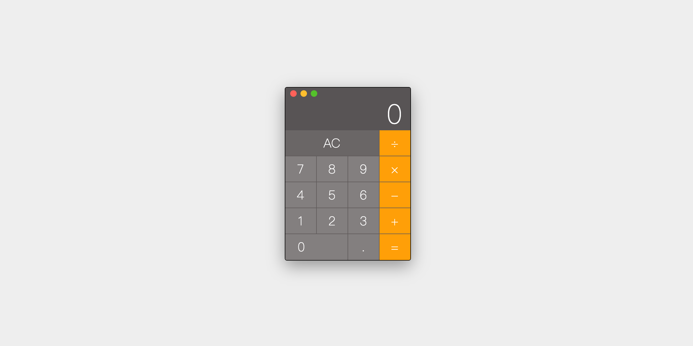

⚠️ This project is no longer maintained. ⚠️

# typescript-calculator

A awesome calculator that simulates a Mac style. Source code is written by Typescript language.



## Preview

Visit here [Demo](http://captaininphw.xyz/typescript-calculator/).

## Usage

If you are interested in this, you can clone this repository and make some changes. After you modified `calculator.ts` file, you should use `tsc` command line tool to covert it so that you can run your code in browser.

```
npm i -g typescript ts-node

// after you modified .ts file, use this command covert it to .js file
tsc ./calculator.ts
```

Have fun.

## License

MIT
